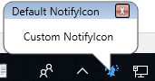

# Getting Started with WPF NotifyIcon
This example demonstrates how to use the Syncfusion WPF [NotifyIcon](https://help.syncfusion.com/wpf/classic/notify-icon/overview) control and its properties. The NotifyIcon control allows you to display an icon in the system tray and interact with users through context menus, balloon tips, and notifications. It is commonly used in applications that need to run in the background while providing quick access to features without occupying space on the taskbar.

## Why This Is Useful
- **Background Applications**: Ideal for apps that run silently but need quick user interaction.
- **Notifications**: Show balloon tips for alerts or updates.
- **Compact UI**: Keeps the taskbar clean while providing easy access to features.

## Key Features
- Display an icon in the system tray.
- Show balloon tips with custom title and text.
- Handle user interactions like mouse clicks or menu selections.

## Code Example
**XAML**
```XAML
<syncfusion:NotifyIcon Name="notify"
                       Header="NotifyIcon"
                       Height="80"
                       Width="150"
                       ShowInTaskBar="True"
                       Text="Notify me"
                       Icon="images\notifyicon.png"
                       BalloonTipTitle="Default NotifyIcon"
                       BalloonTipText="Custom NotifyIcon"
                       BalloonTipHeaderVisibility="Visible" />
```

**C#**
```C#
public MainWindow()
{
    InitializeComponent();
    // Show balloon tip for 3 seconds
    notify.ShowBalloonTip(3000);
}
```

## Output

